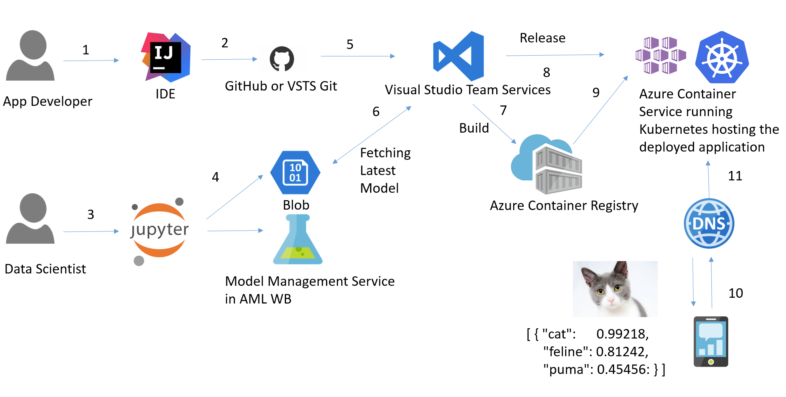

# Introduction

In this course, we will implement a Continuous Integration (CI)/Continuous Delivery (CD) pipeline for Anomaly Detection and Predictive Maintenance applications. For developing an AI application, there are frequently two streams of work:
1. Data Scientists building machine learning models

2. App developers building the application and exposing it to end users to consume

In short, the pipeline is designed to kick off for each new commit, run the test suite, if the test passes takes the latest build, packages it in a Docker container and then deploys to create a scoring service as shown below.

## Modules Covered

The goal of this course is to cover the following modules:

* Introduction to CI/CD
* Create a CI/CD pipeline using Azure
* Customize a CI/CD pipeline using Azure
* Learn how to develop a Machine Learning pipeline to update models and create service

## How to Use this Site

*This site is intended to be the main resource to an instructor-led course, but anyone is welcome to learn here.  The intent is to make this site self-guided and it is getting there.*

We recommend cloning this repository onto your local computer with a git-based program (like GitHub desktop for Windows) or you may download the site contents as a zip file by going to "Clone or Download" at the upper right of this repository.

It is recommended that you do the labs in the below order:

1. lab00.0_Setup
2. lab01.1_BuildPipeline

**For Instructor-Led:**
* We recommend dowloading the site contents or cloning it to your local computer.
* Follow along with the classroom instructions and training sessions.
* When there is a lab indicated, you may find the lab instructions in the Labs folder.

**For Self-Study:**
* We recommend dowloading the site contents or cloning it if you can do so to your local computer.
* Go to Decks folder and follow along with the slides.
* When there is a lab indicated, you may find the lab instructions in the Labs folder.